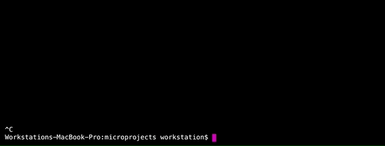

# microprojects
> Microproject and Prototypes creation tool (a static site generator)


example: [open](https://sean-codes.github.io/microprojects)


## How it works
> Don't forget to use `npm install`!

The site and projects are built using gulp. Use `gulp new` to start a new project or `gulp watch` to edit existing ones.

Making changes to a projects src pug(html), scss(css), and js files causes the indidividual project to be built.

Each project can be demoed from its own `project/index.html`.

A project list is kept in the `www.json` and is used to build the `index.html` in the root of this repository.

## Project structure
> Make changes to the `src` folder
```.js
   project/
   ├── index.html // view your project
   ├── index.pug // add plugins here if you like
   ├── bin/
   │   ├── css.css // compiled sass and autoprefixed
   │   ├── js.js // compiled used babel
   │   └── html.pug // only a copy from src
   └── src/
       ├── css.scss // SASS
       ├── js.js // BABEL
       └── html.pug // PUG/JADE/HTML
```


## new project
Duplicates the boilerplate, builds the site, and starts `gulp watch`


```.js
gulp new
>> Project Title: Project Title
```

## watch
continue working on a project
```.js
   gulp watch
```
