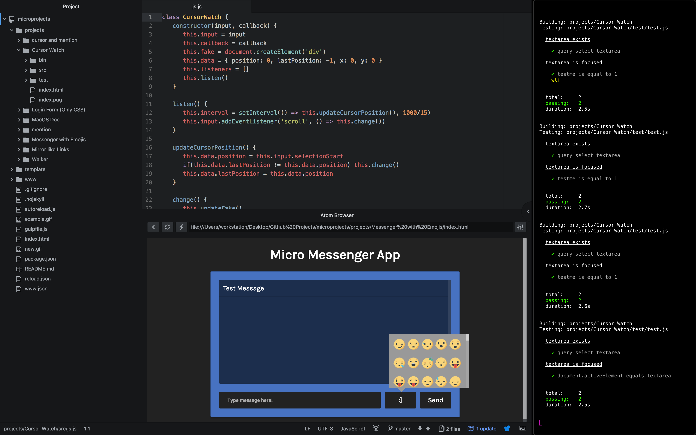

# microprojects
> Microprojects and Prototypes creation tool (a static site generator)


example: [open](https://sean-codes.github.io/microprojects)

# What it does
A tool for quickly developing web projects and keeping a catalog of them.

## Core Features
- Create micro project using template
- Autoreload
- Builds a catalog of projects
- Simple structure
- Pug, SCSS/Autoprefixer, Babel

# How to use

## Viewing
All projects can be viewed from the index.html in the root directory. Each individual project also has an index.html. Using a browser plugin for Atom works well here.

## Creating new projects
> Don't forget to use `npm install`!

``gulp new`` Duplicates the boilerplate, builds the site, and starts `gulp watch`


## Editing existing projects

``gulp watch`` Watches for changes to existing projects

# Project structure
> Make changes to the `src` folder
```.js
   project/
   ├── index.html // view your project
   ├── index.pug // add plugins here if you like
   ├── bin/
   │   ├── css.css // compiled sass and autoprefixed
   │   ├── js.js // compiled used babel
   │   └── html.pug // only a copy from src
   └── src/
       ├── css.scss // SASS
       ├── js.js // BABEL
       └── html.pug // PUG/JADE/HTML
```
